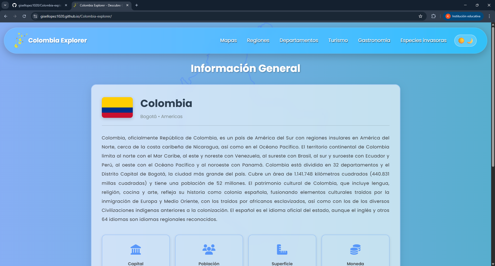
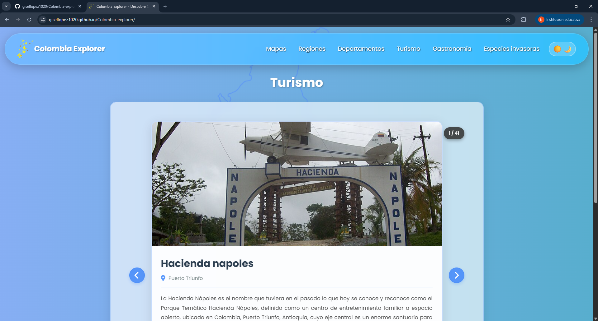
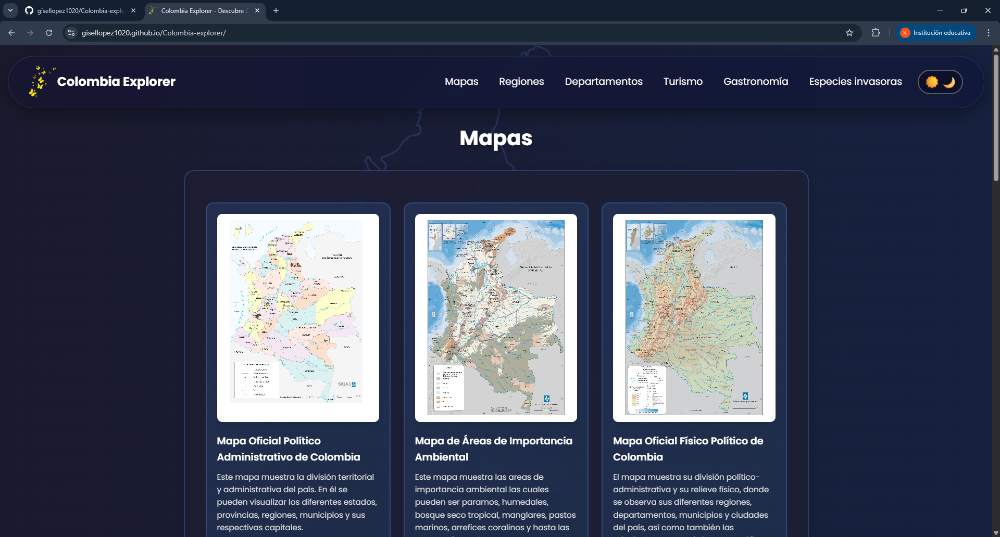
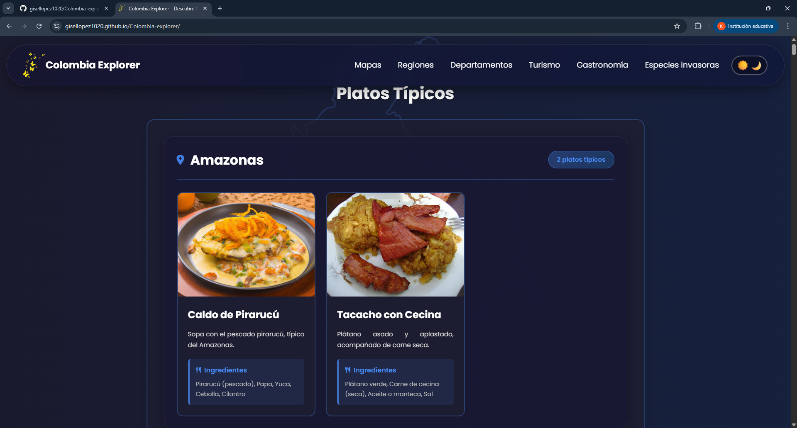

# Colombia Explorer


**Colombia Explorer** es una aplicación web interactiva que permite descubrir y explorar información detallada sobre Colombia, incluyendo sus regiones, departamentos, atractivos turísticos, gastronomía y especies invasoras. Desarrollada con JavaScript Vanilla y diseño responsive, consume datos en tiempo real de la [API Colombia](https://api-colombia.com).

---

## Tabla de Contenidos

- [Características](#-características)
- [Demo](#-demo)
- [Tecnologías](#-tecnologías)
- [Estructura del Proyecto](#-estructura-del-proyecto)
- [Instalación](#️-instalación)
- [Uso](#-uso)
- [API Endpoints](#-api-endpoints)
- [Funcionalidades Principales](#-funcionalidades-principales)
- [Responsive Design](#-responsive-design)
- [Autora](#-autora)

---

## 🌟 Características

✅ **Información General de Colombia**: Datos básicos del país como población, superficie, región, moneda y más.

✅ **Mapas Interactivos**: Visualización de diferentes mapas de Colombia (político, regiones, departamentos).

✅ **Regiones**: Exploración de las 6 regiones naturales de Colombia con información detallada.

✅ **Departamentos**: Información completa de los 32 departamentos incluyendo estadísticas demográficas, económicas y geográficas.

✅ **Turismo**: Galería interactiva con navegación por flechas para explorar los principales atractivos turísticos.

✅ **Gastronomía**: Platos típicos organizados alfabéticamente por departamento.

✅ **Especies Invasoras**: Catálogo de especies invasoras clasificadas por nivel de riesgo con información sobre su impacto y manejo.

✅ **Modo Oscuro/Claro**: Alternancia entre temas con transiciones suaves y persistencia en `localStorage`.

✅ **Diseño Responsive**: Optimizado para dispositivos móviles, tablets y escritorio.

✅ **Menú Hamburguesa**: Navegación móvil con animaciones suaves.

✅ **Efectos Glassmorphism**: Tarjetas con efecto de vidrio esmerilado y transparencias.

✅ **Animaciones CSS**: Transiciones y efectos hover.

---

## 🎨 Demo

🔗 **[Ver Demo en Vivo](https://gisellopez1020.github.io/Colombia-explorer/)**

### Screenshots

**Modo Claro:**




**Modo Oscuro:**



---

## 🚀 Tecnologías

### Frontend
- **HTML5**: Estructura semántica con etiquetas ARIA para accesibilidad
- **CSS3**: 
  - Flexbox y CSS Grid para layouts
  - Custom Properties (variables CSS)
  - Glassmorphism y Backdrop Filter
  - Animaciones y transiciones
  - Media queries para responsive design
- **JavaScript ES6+**:
  - Módulos ES6 (import/export)
  - Async/Await para peticiones HTTP
  - Fetch API
  - LocalStorage para persistencia de tema
  - Event Delegation

### Librerías Externas
- **Font Awesome 6.5.1**: Iconografía
- **Fluent Emoji 3D**: Emojis animados para el toggle de tema
- **Tipo de Letra**: 'Poppins' desde Google Fonts

### API
- **API Colombia v1**: [https://api-colombia.com](https://api-colombia.com)

---

## 📁 Estructura del Proyecto

```
Colombia-explorer/
│
├── assets/                      # Recursos estáticos
│   ├── logo.png                 # Logo de Colombia
│   └── mapa.png                 # Mapa de fondo
│
├── css/                         # Estilos CSS
│   ├── styles.css               # Estilos globales, banner, footer
│   ├── general-info.css         # Información general del país
│   ├── maps-section.css         # Sección de mapas
│   ├── regions-section.css      # Sección de regiones
│   ├── departments-section.css  # Sección de departamentos
│   ├── tourism-section.css      # Galería de turismo
│   ├── gastronomy-section.css   # Sección de gastronomía
│   └── species-section.css      # Especies invasoras
│
├── js/                          # Módulos JavaScript
│   ├── index.js                 # Controlador principal
│   ├── general-info.js          # Renderizado de info general
│   ├── maps-section.js          # Renderizado de mapas
│   ├── regions-section.js       # Renderizado de regiones
│   ├── departments-section.js   # Renderizado de departamentos
│   ├── tourism-section.js       # Galería de turismo
│   ├── gastronomy-section.js    # Renderizado de gastronomía
│   └── species-section.js       # Renderizado de especies
│
├── index.html                   # Página principal
└── README.md                    # Documentación del proyecto
```

---

## ⚙️ Instalación

### Prerrequisitos
- Navegador web moderno (Chrome, Firefox, Edge, Safari)
- Servidor local (opcional): Live Server, http-server, o similar

### Pasos de Instalación

1. **Clonar el repositorio**
   ```bash
   git clone https://github.com/gisellopez1020/Colombia-explorer.git
   ```

2. **Navegar al directorio del proyecto**
   ```bash
   cd Colombia-explorer
   ```

3. **Abrir con Live Server**
   - Si usas VS Code, instala la extensión "Live Server"
   - Click derecho en `index.html` -> "Open with Live Server"
   - Alternativamente, usa cualquier servidor local de tu preferencia

---

## 📖 Uso

### Navegación Principal

1. **Información General**: Click en el título "Colombia Explorer" para ver datos generales del país
2. **Mapas**: Visualiza diferentes tipos de mapas de Colombia
3. **Regiones**: Explora las 6 regiones naturales
4. **Departamentos**: Información detallada de cada departamento (click en las tarjetas para ver más)
5. **Turismo**: Usa las flechas laterales o indicadores para navegar por los atractivos turísticos
6. **Gastronomía**: Descubre platos típicos organizados por departamento
7. **Especies Invasoras**: Catálogo de especies clasificadas por nivel de riesgo

### Funcionalidades Adicionales

- **Cambiar Tema**: Click en el ícono de sol/luna en la esquina superior derecha
- **Menú Móvil**: En dispositivos móviles, click en el ícono de hamburguesa (☰)
- **Ver Detalles**: Click en los botones "Ver más" para abrir modales con información detallada
- **Cerrar Modales**: Click fuera del modal o en el botón X

---

## 🔌 API Endpoints

El proyecto consume los siguientes endpoints de [API Colombia](https://api-colombia.com):

| Endpoint | Descripción | Uso |
|----------|-------------|-----|
| `GET /api/v1/Country/Colombia` | Información general del país | Sección inicial |
| `GET /api/v1/Map` | Lista de mapas disponibles | Sección Mapas |
| `GET /api/v1/Region` | Regiones naturales de Colombia | Sección Regiones |
| `GET /api/v1/Department` | Departamentos de Colombia | Sección Departamentos |
| `GET /api/v1/TouristicAttraction` | Atractivos turísticos | Sección Turismo |
| `GET /api/v1/TypicalDish` | Platos típicos por departamento | Sección Gastronomía |
| `GET /api/v1/Invasivespecie` | Especies invasoras | Sección Especies |

---

## ✨ Funcionalidades Principales

### 1. Galería de Turismo
- Navegación con flechas izquierda/derecha
- Indicadores visuales de posición
- Modal con información detallada (ciudad, departamento, latitud/longitud)
- Imágenes responsive con lazy loading

### 2. Departamentos con Estadísticas
- Tarjetas con información demográfica
- Uso de HTML semántico (`<dl>`, `<dt>`, `<dd>`)
- Modal con datos completos: superficie, población, municipios, ciudades
- Iconos representativos por categoría

### 3. Especies Invasoras
- Clasificación por nivel de riesgo (Alto, Medio, Bajo)
- Badges de color según peligrosidad
- Estadísticas generales en el header
- Modal con información científica, impacto ambiental y manejo

### 4. Gastronomía por Departamento
- Agrupación alfabética automática
- Sección independiente por cada departamento
- Diseño de tarjetas consistente
- Nombres científicos con énfasis tipográfico

### 5. Sistema de Temas
- Toggle con iconos animados (Sol/Luna)
- Transiciones suaves entre modos (0.5s)
- Persistencia usando `localStorage`
- Colores adaptativos en todo el sitio

---

## 📱 Responsive Design

El sitio está optimizado para tres breakpoints principales:

### 🖥️ Desktop (> 1024px)
- Layout de 3-4 columnas en grids
- Banner horizontal completo
- Navegación inline

### 📱 Tablet (768px - 1024px)
- Layout de 2-3 columnas
- Banner ajustado
- Menú en línea compacto

### 📱 Mobile (< 768px)
- Layout de 1 columna
- Menú hamburguesa lateral
- Banner compacto con elementos reordenados
- Imágenes optimizadas

---

## 👤 Autora

**Karen Gisel López Ordoñez**

- GitHub: [@gisellopez1020](https://github.com/gisellopez1020)
- Proyecto: [Colombia Explorer](https://github.com/gisellopez1020/Colombia-explorer)
- Despliegue: [Colombia Explorer en GitHub Pages](https://gisellopez1020.github.io/Colombia-explorer/)

---

## Agradecimientos

- Datos proporcionados por [API Colombia](https://api-colombia.com)
- Iconos de [Font Awesome](https://fontawesome.com)
- Emojis de [Fluent Emoji 3D](https://github.com/microsoft/fluentui-emoji)

---

## 🔄 Versionado

**Versión actual: 1.0.0** (Noviembre 2025)
- Primera versión estable con todas las funcionalidades principales implementadas.

---

## 🐞 Reportar Problemas

Si tienes preguntas, sugerencias o encuentras algún bug, no dudes en:
- Abrir un [Issue](https://github.com/gisellopez1020/Colombia-explorer/issues)
- Enviar un [Pull Request](https://github.com/gisellopez1020/Colombia-explorer/pulls)

---

<div align="center">

**Hecho en Colombia 🇨🇴**

⭐ Si te gusta este proyecto, ¡dale una estrella en GitHub! ⭐

</div>